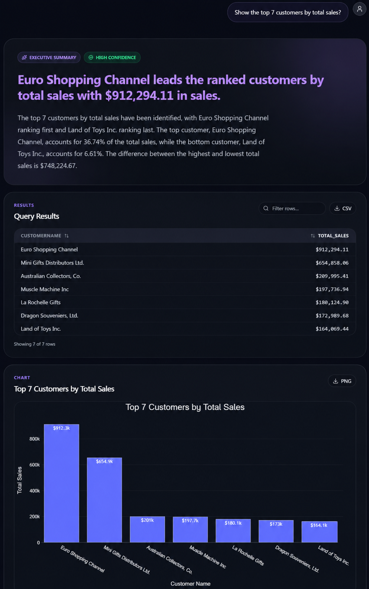
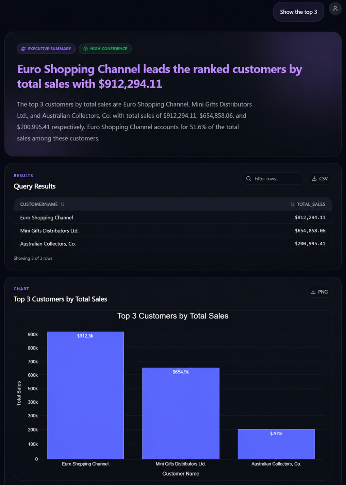
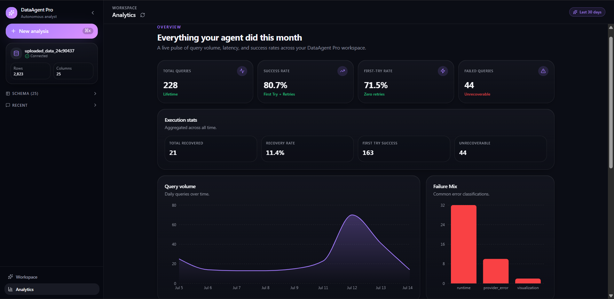
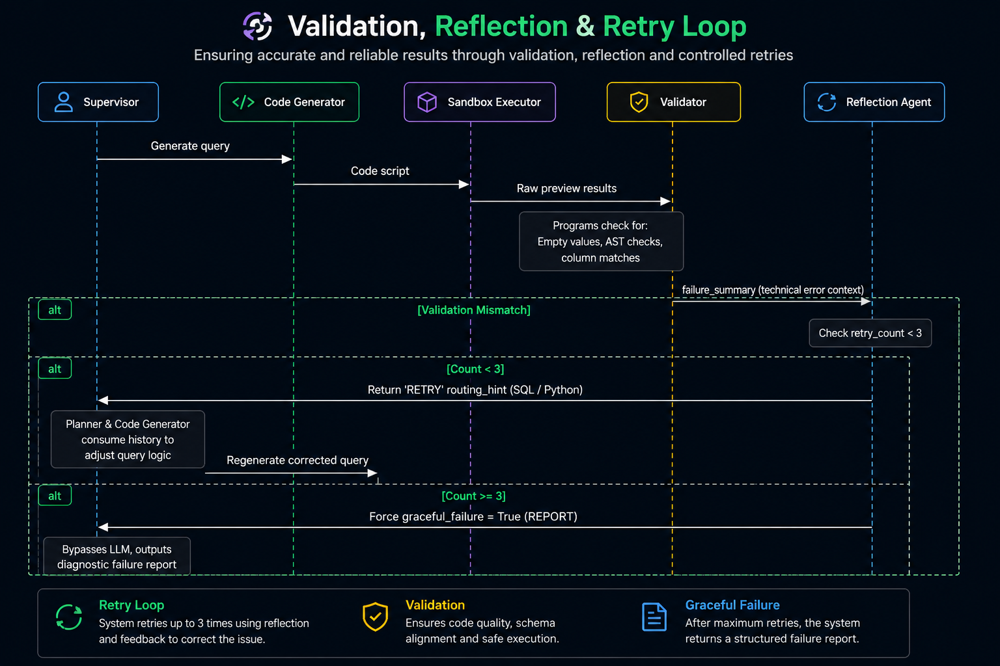

<div align="center">

# GraphAnalyst

### Stateful Multi-Agent Data Analysis with LangGraph

> **An Agentic AI Data Analysis System for Reliable Analytical Workflows**

Analyze CSV datasets using natural language through a **stateful LangGraph workflow** that combines **LLM reasoning**, **deterministic execution**, **safe validation**, and **interactive visualizations**.

Generate grounded analytical insights with validated SQL, Python execution, and persistent conversational memory.

<br>


<br>


</div>

---

## 📸 Product Preview

The following screenshots demonstrate the complete workflow—from dataset upload and conversational analysis to validated results, interactive visualizations, generated SQL, and execution analytics.

### 1. Dataset Upload
Upload a CSV dataset to start a new analysis session. The agent automatically profiles the dataset, identifies its schema, and prepares it for downstream analytical tasks.
<p align="center">
  
</p>

---

### 2. Main Analysis Workspace
The primary workspace where users ask analytical questions in natural language. The agent plans the workflow, generates SQL or Python when required, validates execution, and presents grounded analytical results in real time.
<p align="center">
  
</p>

---

### 3. Example Analysis — Monthly Sales Trend
A complete analytical report including:
- Executive Summary
- Query Results
- Interactive Visualization
- Statistical Insights
<p align="center">
  
</p>

---

### 4. Conversational Follow-up Analysis
The agent maintains conversation state using LangGraph checkpointing, allowing follow-up questions without re-uploading the dataset.

Example:
> *"Show the top 3"*

The system automatically understands the previous analytical context.
<p align="center">
  
</p>

---

### 5. Explainable AI & Debug Information
Every analytical result is fully transparent. The agent exposes:
- Generated SQL
- LLM reasoning
- Execution plan
- Runtime metadata
<p align="center">
  
</p>

---

### 6. Analytics & Observability Dashboard
The built-in analytics dashboard tracks system performance, execution latency, retry rates, recovery statistics, and historical execution metrics.
<p align="center">
  
</p>

---

## 💡 Why This Project is Different

Many AI data analysis tools primarily generate SQL or Python using an LLM and return the result directly. GraphAnalyst combines **LLM reasoning** with **deterministic execution**, **stateful workflows**, and **validation pipelines** to produce reliable analytical results.

| Capability | Typical AI Data Assistant | GraphAnalyst |
| :--- | :--- | :--- |
| **Workflow** | Single-step LLM response | **Stateful LangGraph multi-agent workflow** |
| **Calculations** | Performed or generated by the LLM | **Executed deterministically using DuckDB, Pandas & NumPy** |
| **Conversation Memory** | Limited chat history | **Persistent LangGraph checkpoints with PostgreSQL** |
| **Error Recovery** | Stops on failures | **Validation, reflection, and automatic retries** |
| **Execution Safety** | Limited validation | **SQL validation and Python AST security checks** |
| **Explainability** | Final answer only | **Generated SQL, execution plan, reasoning, and reports** |
| **Observability** | Minimal execution visibility | **Pipeline timeline, execution metrics, and analytics dashboard** |
| **Tool Integration** | Direct tool calls | **MCP-based tool architecture with fallback support** |

---

## 🛠️ Core Engineering Highlights

- **LangGraph Supervisor** — Routes requests to specialized workers for modular execution.
- **Persistent Memory** — PostgreSQL checkpoints preserve conversation state across sessions.
- **Safe Code Execution** — SQL validation and Python AST checks improve reliability and security.
- **MCP Tool Integration** — Analytical capabilities are exposed through Model Context Protocol with automatic fallback to local implementations.
- **Grounded AI Reports** — The LLM explains deterministic results instead of generating numbers.
- **Session Isolation** — Each analysis runs in an independent DuckDB session with automatic cleanup.

---

## 🧩 System Architecture

GraphAnalyst follows a **stateful multi-agent architecture** built with **LangGraph**. A central Supervisor coordinates specialized workers for planning, execution, validation, visualization, and reporting, while PostgreSQL preserves workflow state across sessions.

<p align="center">
  
</p>

---

## 🔄 Validation, Reflection & Retry Loop

Every generated SQL or Python script is validated before execution. If validation fails or results are unreliable, the system automatically reflects on the failure, regenerates the query, and retries execution up to 3 times before returning a structured diagnostics report.

<p align="center">
  
</p>

---

## ⚙️ Tech Stack

| Category | Technologies |
| :--- | :--- |
| **Frontend** | React, TypeScript, Tailwind CSS, Vite |
| **Backend** | FastAPI, Python |
| **AI Framework** | LangGraph, LangChain |
| **LLMs** | Groq (Llama 3.3 70B), Gemini 2.5 Flash |
| **Database** | PostgreSQL, DuckDB |
| **Data Processing** | Pandas, NumPy |
| **Visualization** | Plotly |
| **Reporting** | ReportLab |
| **Tool Integration** | Model Context Protocol (MCP) |

---

## 📁 Project Structure

```text
GraphAnalyst/
├── backend/                # FastAPI + LangGraph workflow
│   ├── agents/             # Multi-agent nodes, supervisor & state
│   ├── database/           # DuckDB & PostgreSQL connections
│   ├── mcp/                # Model Context Protocol tools & client
│   ├── services/           # LLM, analysis & storage services
│   └── utils/              # AST and SQL security validators
├── frontend/               # React + Vite TypeScript application
├── screenshots/            # Architectural diagrams & UI previews
├── docker-compose.yml
├── requirements.txt
└── README.md
```

---

## 🚀 Getting Started

### 1. Clone the Repository

```bash
git clone https://github.com/Namanbansal43/GraphAnalyst.git
cd GraphAnalyst
```

### 2. Start PostgreSQL

```bash
docker-compose up -d
```

### 3. Backend Setup

```bash
python -m venv .venv

# Activate environment
# Windows
.venv\Scripts\activate
# Linux / macOS
source .venv/bin/activate

pip install -r requirements.txt
cp .env.example .env
```

Configure your API keys inside `.env` and start the backend:

```bash
uvicorn backend.main:app --reload
```

### 4. Frontend Setup

```bash
cd frontend
npm install
npm run dev
```

Open:
- Frontend: `http://localhost:5173`
- Backend: `http://localhost:8000`

---

## 📄 License

This project is licensed under the **MIT License**.

---

## 👤 Author

**Naman Bansal**
