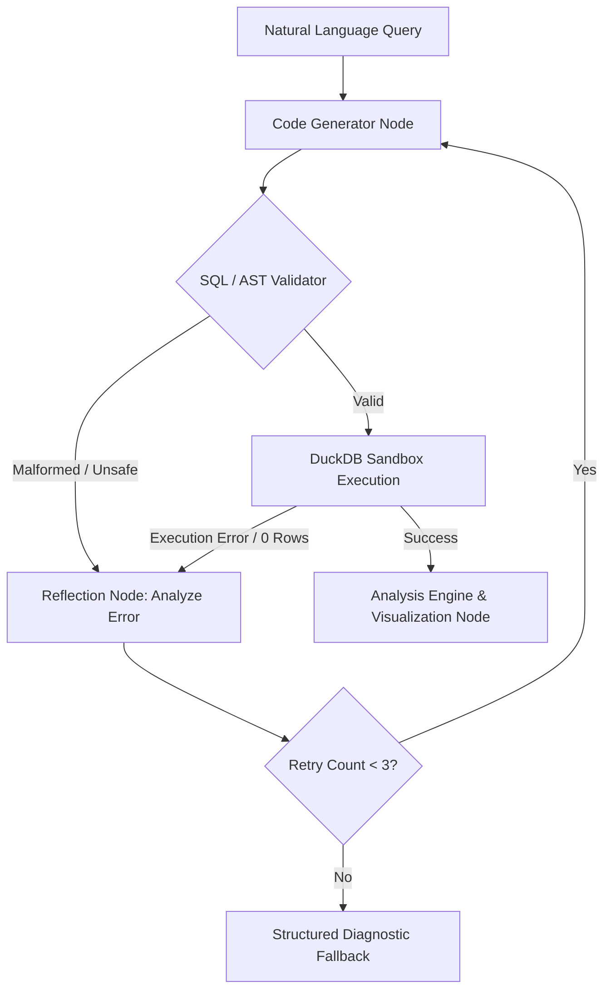

<div align="center">

# GraphAnalyst

### Stateful Multi-Agent Data Intelligence Engine with LangGraph, DuckDB & MCP

> **An enterprise-grade autonomous data analytics system engineered for deterministic reasoning, robust validation, and self-healing query execution.**

Analyze tabular datasets using natural language through a **stateful LangGraph multi-agent topology** that orchestrates **LLM reasoning**, **isolated in-memory SQL execution (DuckDB)**, **AST-level code safety validation**, and **interactive Plotly visualizations**.

<br>


</div>

---

## 1. Product Walkthrough

GraphAnalyst provides an end-to-end analytical workflow from CSV ingestion to multi-turn natural language exploration, deterministic computations, dynamic charting, and diagnostic telemetry.

### 1.1 Dataset Upload & Automated Schema Profiling
Upload arbitrary CSV datasets. GraphAnalyst profiles column data types, computes null cardinality, extracts statistical distributions, and registers an isolated DuckDB table instance for query operations.
<p align="center">
  
</p>

---

### 1.2 Main Analysis Workspace
Users issue natural language analytical questions. The LangGraph Supervisor delegates requests across specialized agent nodes, producing SQL queries, validating data integrity, and streaming grounded reports.
<p align="center">
  
</p>

---

### 1.3 Analytical Query Output & Dynamic Visualizations
Full executive summaries accompanied by generated SQL, tabular query outputs, statistical distributions, and interactive Plotly visual charts.
<p align="center">
  
</p>

---

### 1.4 Multi-Turn Conversational Memory & Contextual Follow-ups
Powered by PostgreSQL-backed LangGraph state checkpointing, GraphAnalyst retains full contextual history across turns (e.g., *"Show the top 3"*, *"Break this down by region"*) without reprocessing the initial prompt.
<p align="center">
  
</p>

---

### 1.5 Explainable AI, Execution Plans & Diagnostics
Full visibility into LLM thought processes, generated SQL syntax, AST validation status, DuckDB execution latency, and token consumption.
<p align="center">
  
</p>

---

### 1.6 Observability, Health & Performance Dashboard
Integrated observability console tracking system throughput, query retry frequencies, node transition latencies, and agent success rates.
<p align="center">
  
</p>

---

## 2. Core Architectural Differentiators

Most AI data assistants rely on naive single-shot LLM code generation, which frequently hallucinates aggregations, produces dangerous code, or crashes on SQL syntax errors. GraphAnalyst separates **analytical reasoning** from **deterministic computation**.

| Engineering Dimension | Traditional Text-to-SQL / Chatbots | GraphAnalyst Architecture |
| :--- | :--- | :--- |
| **Workflow Coordination** | Linear single-prompt chain | **Stateful LangGraph multi-agent directed acyclic graph (DAG)** |
| **Calculations & Math** | Computed / guessed by LLM | **Vectorized DuckDB in-memory execution + NumPy / Pandas** |
| **Memory Persistence** | In-memory message list (ephemeral) | **PostgreSQL checkpointer preserving full graph state & thread history** |
| **Error Recovery** | Fails outright on syntax or schema errors | **Self-correcting reflection loop with automated regeneration (up to 3 retries)** |
| **Security & Guardrails** | Minimal or raw `exec()` evaluation | **Dual-layer validation: SQL AST parser + Python AST security inspector** |
| **Tool Protocol** | Proprietary function calling | **Anthropic Model Context Protocol (MCP) server + local fallback bridge** |
| **Observability** | Black-box output | **Fine-grained node telemetry, latency breakdown, and execution logs** |

---

## 3. System Architecture

GraphAnalyst is built on a **Stateful Multi-Agent Supervisor Pattern**. The supervisor node inspects user intent, schema profile, and execution state to route execution dynamically to worker nodes.

<p align="center">
  
</p>

### Multi-Agent Pipeline Nodes:
1. **Supervisor Node**: Inspects user intent, session context, and schema to dynamically construct an execution plan.
2. **Schema Profiler**: Extracts schema metadata, data types, null ratios, sample distributions, and categorical values.
3. **Code Generator**: Generates standards-compliant DuckDB SQL queries or Python transformation scripts tailored to the schema.
4. **Validator Node**: Runs AST security checks and syntax verification before permitting execution.
5. **Execution Engine (Sandbox)**: Safely evaluates validated queries against the isolated DuckDB session.
6. **Reflection & Retry Node**: Captures syntax errors, zero-row edge cases, or schema mismatches, injecting diagnostic feedback into the code generator for iterative correction.
7. **Analysis Engine**: Synthesizes statistical insights and trend observations strictly grounded in the execution output.
8. **Visualization Agent**: Selects chart types (bar, line, scatter, box, heatmap) and generates Plotly JSON specifications.
9. **Report Agent**: Compiles executive summaries, structured key takeaways, and strategic recommendations into a unified payload.

---

## 4. Self-Healing Reflection & Retry Loop

When a generated query fails execution or fails schema checks, GraphAnalyst does not abort. It enters an automated reflection loop:

<p align="center">
  
</p>



---

## 5. Security & AST-Level Code Sandboxing

To ensure complete safety when executing dynamic analytics:
* **SQL Quality Validator**: Enforces strict read-only query semantics (`SELECT`, `WITH` CTEs), blocking destructive operations (`DROP`, `DELETE`, `UPDATE`, `ALTER`, `INSERT`).
* **Python AST Inspector**: Analyzes abstract syntax trees of Python code to prohibit dangerous imports (`os`, `sys`, `subprocess`, `shutil`, `socket`) and malicious builtins (`eval`, `exec`, `__import__`).
* **Process Isolation**: Each dataset session operates within its own dedicated DuckDB in-memory database with automatic memory cleanup.

---

## 6. Technology Stack

| Layer | Component | Description |
| :--- | :--- | :--- |
| **Frontend** | React 19, TypeScript, Vite | Dark-first analytics workspace with real-time streaming UI |
| **Styling** | Tailwind CSS, Radix UI, Lucide | Modern design system with responsive layouts and fluid state transitions |
| **Visualizations** | Plotly.js | Interactive charts with zooming, panning, and dynamic theme synchronization |
| **API Backend** | FastAPI, Uvicorn, Pydantic v2 | High-throughput asynchronous REST API and WebSocket/streaming endpoints |
| **Agent Framework** | LangGraph, LangChain | Stateful multi-agent graph with dynamic routing and state persistence |
| **LLM Inference** | Groq (Llama 3.3 70B), Gemini 2.5 Flash | High-speed analytical reasoning and grounded narrative generation |
| **Execution Engine** | DuckDB, Pandas, NumPy | Vectorized in-memory analytical SQL database for ultra-fast query processing |
| **State Store** | PostgreSQL | Robust thread checkpointer preserving conversation state across sessions |
| **Tool Protocol** | FastMCP (Model Context Protocol) | Standardized tool integration layer with fallback handlers |
| **Reporting** | ReportLab | Automated PDF analytical report generation with embedded visuals |

---

## 7. Project Structure

```text
GraphAnalyst/
├── backend/
│   ├── agents/
│   │   ├── nodes/
│   │   │   ├── analysis_engine.py       # Insight synthesis node
│   │   │   ├── code_generator.py        # SQL and Python generation
│   │   │   ├── planner.py               # Analytical execution planning
│   │   │   ├── python_analyst.py        # Python-based transformations
│   │   │   ├── reflection.py            # Error diagnostics and feedback
│   │   │   ├── report_agent.py          # Executive report composition
│   │   │   ├── sandbox_executor.py      # DuckDB sandbox execution
│   │   │   ├── schema_profiler.py       # Dataset profiling and schema extraction
│   │   │   ├── supervisor.py            # LangGraph routing coordinator
│   │   │   ├── validator.py             # AST syntax & safety validator
│   │   │   ├── visualization_generator.py # Plotly visualization generation
│   │   │   └── visualization_reflection.py# Chart validation & correction
│   │   ├── capability_registry.py       # Dynamic agent skill registration
│   │   ├── graph.py                     # LangGraph StateGraph assembly
│   │   ├── sandbox.py                   # Secure execution sandbox
│   │   ├── schemas.py                   # Data schemas and event models
│   │   └── state.py                     # Overall multi-agent state definitions
│   ├── database/
│   │   ├── connection.py                # PostgreSQL & DuckDB connection pools
│   │   └── repository.py                # Query history and session repositories
│   ├── mcp/
│   │   ├── client.py                    # Model Context Protocol client
│   │   └── data_access.py               # MCP data access endpoints
│   ├── mcp_server/
│   │   └── server.py                    # FastMCP server for analytical tools
│   ├── services/
│   │   ├── pdf_generator.py             # PDF export and formatting
│   │   ├── python/python_quality_validator.py # AST inspection for Python
│   │   ├── reporting/                   # Report formatters and recommendation engine
│   │   ├── session_manager.py           # Multi-tenant session state
│   │   ├── sql/sql_quality_validator.py # Strict read-only SQL safety
│   │   ├── statistics.py                # Statistical metric computations
│   │   └── visualization/               # Chart selection and templates
│   ├── tests/                           # Unit & integration test suites
│   ├── config.py                        # Central settings and environment config
│   └── main.py                          # FastAPI application entrypoint
├── frontend/
│   ├── src/
│   │   ├── components/                  # UI components, layout, cards, Plotly charts
│   │   ├── pages/                       # Workspace and Analytics dashboards
│   │   ├── services/                    # API client and analytics endpoints
│   │   ├── types/                       # TypeScript analytical interfaces
│   │   ├── App.tsx                      # Root component and navigation
│   │   └── index.css                    # Design tokens and styles
│   ├── index.html                       # HTML5 template
│   ├── package.json                     # Frontend dependencies
│   └── vite.config.ts                   # Vite build configuration
├── screenshots/                         # Architectural diagrams and application previews
├── docker-compose.yml                   # PostgreSQL container configuration
├── requirements.txt                     # Backend Python dependencies
└── README.md                            # Project documentation
```

---

## 8. Getting Started

### Prerequisites
* Python 3.11+
* Node.js 18+ and npm
* Docker & Docker Compose (for PostgreSQL checkpointing)

### 8.1 Clone the Repository
```bash
git clone https://github.com/Namanbansal43/GraphAnalyst.git
cd GraphAnalyst
```

### 8.2 Start Database Services
```bash
docker-compose up -d
```

### 8.3 Backend Setup
```bash
# Create and activate virtual environment
python -m venv .venv

# Windows
.venv\Scripts\activate
# macOS / Linux
source .venv/bin/activate

# Install dependencies
pip install -r requirements.txt

# Configure environment variables
cp .env.example .env
```

Add your API keys (`GROQ_API_KEY`, `GEMINI_API_KEY`, `DATABASE_URL`) to `.env`, then start the FastAPI server:
```bash
uvicorn backend.main:app --reload --port 8000
```

### 8.4 Frontend Setup
```bash
cd frontend
npm install
npm run dev
```

Open your browser:
* **Frontend Application**: `http://localhost:5173`
* **FastAPI Swagger Docs**: `http://localhost:8000/docs`

---

## 9. Running Tests

```bash
# Execute backend test suite
pytest backend/tests -v
```

---

## 10. License

This project is licensed under the **MIT License**.

---

## 11. Author

**Naman Bansal**  
* GitHub: [@Namanbansal43](https://github.com/Namanbansal43)  
* Email: [namanbansal937@gmail.com](mailto:namanbansal937@gmail.com)
